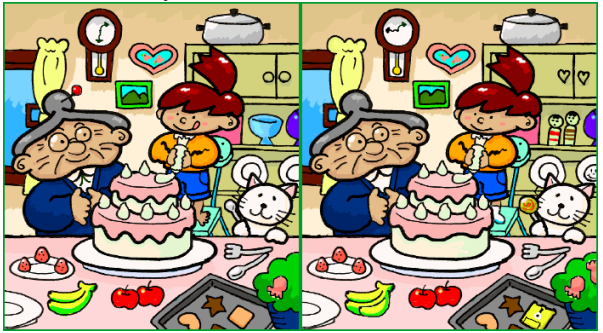

# Mob Programming

## Regeln

- Driver sitzt an Tastatur und tippt
- Navigator sagt was getippt werden soll
- Mob unterstuetzt Navigator
- WICHTIG: Rotation alle 4-5 Minuten

## Rollenverteilung

### Driver

- Der Driver sollte nur Tippen, und nicht denken!
- Damit etwas passiert, ist man gezwungen zu kommunizieren!

### Navigator

- Das Programmieren macht hauptsaechlich der Navigator.
- Ruecksprache mit dem Mob ist normal.
- Der Navigator hat das letzte Wort.
- Der Navigator sollte auf moeglichst abstrakten Niveau erklaeren, was gemacht werden soll.
- Gerade am Anfang muss evtl. diktiert werden, was der Driver tippen muss.

### Mob

- Mob ueberprueft den Navigator.
- Mob gibt Feedback.
- Schnelle Rotation, also muss jeder aufpassen!

### Facilitator

- Unterstuetzt den geregelten Ablauf (Rotation)
- Unterstuetzt bei Bedarf auch fachlich/technisch

## Tipps und Tricks

- Kleine Schritte, haeufiges Feedback
- Kleine Schritte, haeufige Checkins ("Micro-Commits")

## Retrospective

Warum macht man eine Retrospektive?

- **Gemeinsam** Lernen
- Hilft Gedanken zu formulieren/artikulieren

### Selective attention

Jeder uebersieht mal was...

### Expectation biases

Unsere Wahrnehmung ist nicht immer objektiv. Manchmal verstehen wir etwas falsch (oder bekommen es "in den falschen Hals").

### Single perspective

Unterschiedliches Vorwissen kann den Effekt von Scheuklappen haben, da man Dinge nur aus einer Perspektive wahrnimmt.

### Sticky notes

Wir sind alle faul und moechten die Information einfach aufbereitet haben.

- Eine Idee pro Zettel
- Wenig Worte
- Lesbar schreiben
- Grossbuchstaben verwenden

