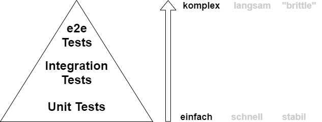
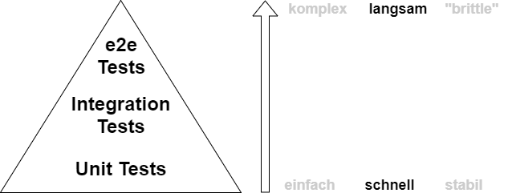
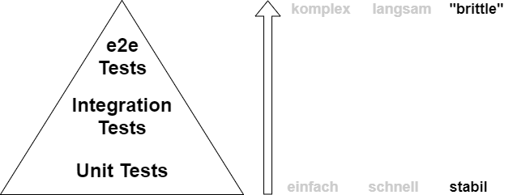
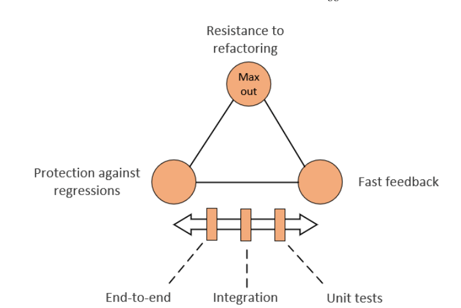
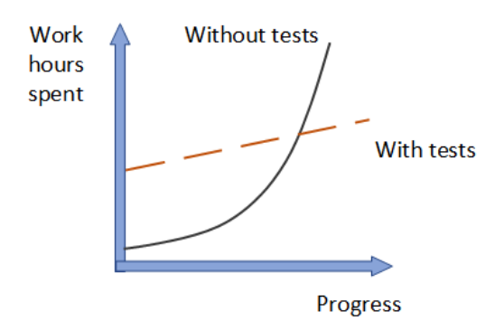
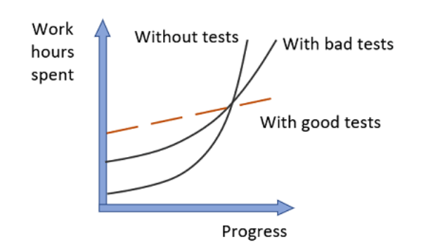

## Why do we test?

interaction!!

pen & paper -> write sticky notes

----

- prevent regression bugs
- improve quality / exposes edge cases
- find bugs early
- documentation
- simplifies debugging
- forces us to think about design (for example integration with other components)

---

## Different kinds of tests

- unit tests
- integration tests
- smoke tests
- end-to-end tests
- system tests
- acceptance tests
- ui tests
- ...

---

## Test pyramide

----

----

----

---

---

---

---

## Agenda

- purpose of testing
- testing frameworks basics
- assertion libraries
- **we code!**
- integration testing & mocking
- **we code!**
- introduction to TDD
