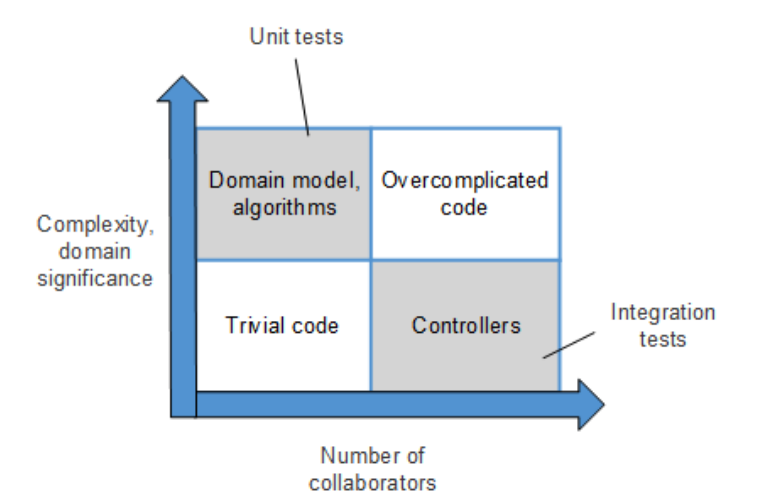
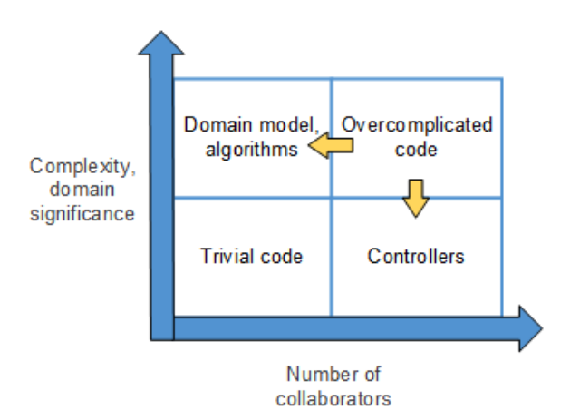
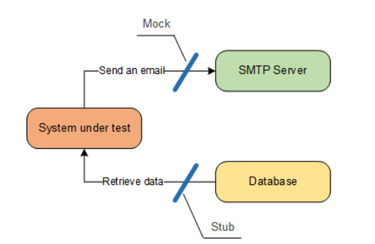

## Integration testing

- testing how different components interact
- composing interactions

---

## Integration testing

- Always a good indicator for
  - decoupling
  - correct layer of abstraction

---

## Test matrix



---

## Test matrix - Code smell

- "overcomplicated code" quadrant
  - wrong layer of abstraction 
  - missing encapsulation
- solution: move logic to domain object

---



---

## What should we test?

- **focus on user stories**, not on technical details
- **often evokes better design!**
- when testing technical details:
  - focus on happy path
  - bug report: write a test demonstrating the bug; then fix the bug
  - keep techn. tests maintainable!

---

## Test Doubles

- Mock (spy)
  - emulate **outcoming** interactions
- Stub (dummy, fake)
  - emulate **incoming** interactions

Many modern frameworks don't make this distinction.

---



---

## Manually creating Mocks

- only useful for simple objects
- time consuming

---

## Mocking frameworks

- often require interface or virtual methods (C#)
- focus on methods required in test
- setup pre conditions
- verify post conditions

---

## C# Mocking frameworks

- [Moq](https://github.com/moq/moq4)
  - can also mock classes without interfaces
- [NSubstitute](https://nsubstitute.github.io/)
  - nice API
- [FakeItEasy](https://fakeiteasy.github.io/)
  - nice API
  
---

### NSubstitute

```csharp
// Arrange
var mailer = Substitute.For<IMailer>(); // <--

var validCustomer = new ValidCustomer();

// We inject an interface to the system-under-test!
// Mocking frameworks can control the behaviour of the injected object!
var sut = new RegistrationService(mailer);

// Act
sut.Register(validCustomer);

// Assert
mailer.Received().Send(); // <--
```

---

examples in code
