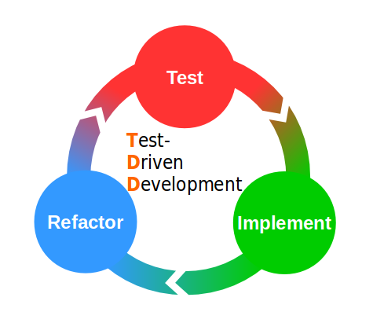

**now** you know the **tooling**!

---

Let's use **testing** to **DRIVE** our **development**!

---

## Recap: Traditional approach

- Design
- Imlementation
- Test

---

### Drawbacks when writing tests at end

- low test coverage
- late testing: rethink problem
- knowledge of implementation: changes how tests are written
- not automated

---

## Test-Driven Development (TDD)

- Design
- Test
- Implementation

---

## TDD Workflow

- Red
- Green
- Refactor

---

---

- no code without test
- untested code should not go live
- baby steps: only write code to make test pass

---

## green bar pattern 

- "fake it til you make it"
- triangulation
- obvious implementation

---

### Advantages of TDD

- high test coverage
- increases modularity
- improves maintainability
- implicit documentation

---

let's code

Fizz-Buzz Kata

---

## Schools of TDD

- **Classical**
  - aka Detroit, Chicago, "inside-out", "fake it til you make it"
  - K. Beck: Test-Driven Development By Example
- **London** 
  - aka moquist, "outside-in"
  - Freeman & Pryce: Growing Object Oriented Software Guided by Tests
- Munich: [David Voelkl](https://www.youtube.com/watch?v=n62HN2DHDEU)
- Hamburg: [Ralph Westpfahl](https://ralfw.de/2019/07/hamburg-style-tdd/)
